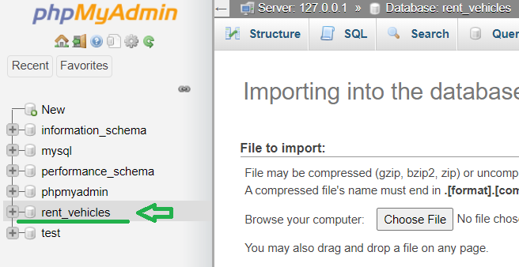
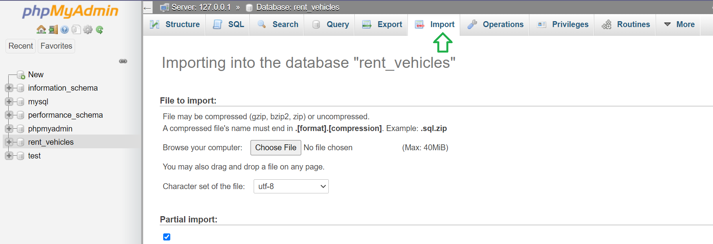
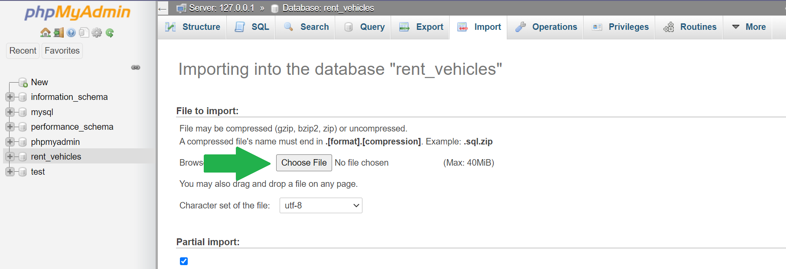
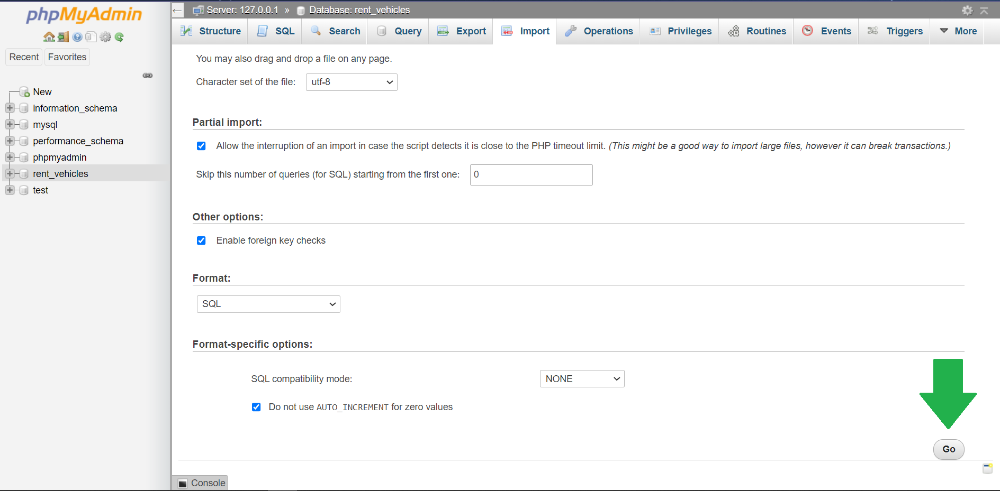

# Isi Rent Backend

## About
Backend repository for Isi Rent applications, which is built with express js and mysql. In this application we can register by email and make a reservation to rent some vehicles.

## How to Use This API

### with API Url
https://isi-rent.herokuapp.com
### Manual Instalation

1. Clone this repo
```
git clone https://github.com/rintosaputro/isi-rent-backend.git
```

2. Install module
```
npm install
```

3. Import Database
```
Open phpMyAdmin, chose databases


```
```
Chose menu import


```
```
Click  chose file button and select the rent_vehicles.sql file


```
```
Click go button


```

4. Runt Apps
```
npm run start
```

5. Done

#### Auth Endpoint
| METHOD | API | REMARKS |
| :-------------: |:-------------:|:-----------:|
| ```POST``` | /auth/register | Registration user |
| ```POST``` | /auth/send-code-verify | Send Code Verification account to email |
| ```POST``` | /auth/verification | Enter Verification Code |
| ```POST``` | /auth/login | Login account |
| ```POST``` | /auth/forgotPassword | Send Code for Forgot Password and Enter Code |

#### Users Endpoint
| METHOD | API | REMARKS |
| :-------------: |:-------------:|:-----------:|
| ```GET``` | /users | Get Users With Search By Name And Pagingation |
| ```GET``` | /users/:id | Get Data User By idUser |
| ```POST``` | /users | Input Data Users |
| ```PUT``` | /users/:id | Update All Selected User Data |
| ```PATCH``` | /users/:id | Update Some Data User By idUser |
| ```DELETE``` | /users/:id | Delete User By idUser |

#### Profile  Endpoint
| METHOD | API | REMARKS |
| :-------------: |:-------------:|:-----------:|
| ```GET``` | /profile | Get User Data Logged in |
| ```PATCH``` | /profile | Update User Data Logged in |

#### Vehicles Endpoint
| METHOD | API | REMARKS |
| :-------------: |:-------------:|:-----------:|
| ```GET``` | /vehicles | Get Vehicles With Search / Filter |
| ```GET``` | /vehicles/:id | Get Data By idVehicle |
| ```POST``` | /vehicles | Add Data Vehicles  |
| ```PUT``` | /vehicles/:id | Update All Selected Vehicle Data|
| ```PATCH``` | /vehicles/:id | Update Some Selected Vehicle Data|
| ```DELETE``` | /vehicles/:id | Delete Vehicle By idVehicle |

#### Popular Vehicles Endpoint
| METHOD | API | REMARKS |
| :-------------: |:-------------:|:-----------:|
| ```GET``` | /popular/?search=&page=&limit= | Get Popular Vehicles With Search By Type And Pagination |

#### Histories Endpoint
| METHOD | API | REMARKS |
| :-------------: |:-------------:|:-----------:|
| ```GET``` | /histories | Get Histories With Search And Pagination |
| ```GET``` | /histories/filter | Get Histories With Filter (location, createdAt, sort, page and limit) |
| ```GET``` | /histories/:id | Get History By idHistory |
| ```POST``` | /histories | Add Data History (id_vehicle, rent_start_date, rent_end_date) |
| ```POST``` | /histories/complete | Add Complete Data History (id_vehicle, rent_start_date, rent_end_date, prepayment) |
| ```PATCH``` | /histories/:id | Update Some Data history By idHistory |
| ```PUT``` | /histories/:id | Update All Data history By idHistory |
| ```DELETE``` | /histories/:id | Delete History By idHistory |

#### Categories Endpoint
| METHOD | API | REMARKS |
| :-------------: |:-------------:|:-----------:|
| ```GET``` | /categories | Get Categories With Search By Type And Pagination |
| ```GET``` | /categories/:id | Get Category By idCategory |
| ```POST``` | /categories | Input Data Category |
| ```PATCH``` | /categories/:id | Update Some Data History By idCategory |
| ```PUT``` | /categories/:id | Update ALl Data History By idCategory |
| ```DELETE``` | /categories/:id | Delete Category By idCategory |
